# Linux Basic Command 

1:- Command to Change User Name on Temorary bases in Terminal
    
        Command:- PS1="ROOT#"

2:- Command to clear screen

     Command:- clear

        Before Clear Command

        After Clear Command

3:- To check the current user
   
        Command:- whoami

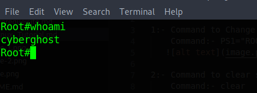

4:- To Check the Present Working Directory

        Command:- pwd

5:- To check File in the directory we use

         Command:- ls and ls -la ("ls -;a" is used for listing with file with permission and file size )

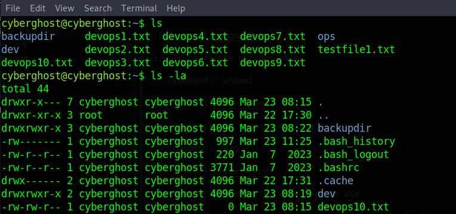

6:- To Read the content of File.

     Command:- cat <FileName>

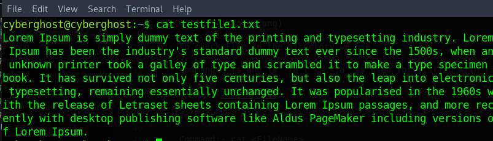

7:- Command for Swithcing to "Root" user.

        Command:- sudo -i

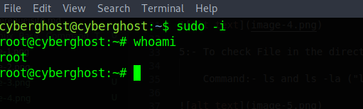    

8:- Command to Change Directory

        Command:- cd <Directory Name>

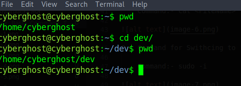

9:- To crete directory 

        Command:- mkdir <directory-name>

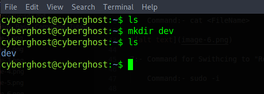

10:- Create File using "Touch" Command

        Command:- touch <file-name>

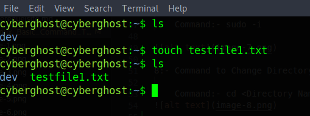

11:- Copying file from one directory to other
    
         Command:- cp <file-name> <diretory-name>
              

    If We want to copy the directory then we have to use '-r' parameter with the command.
        Command:- cp -r <coppied-dir-name> <directory-name-where-we-have-to-copy>

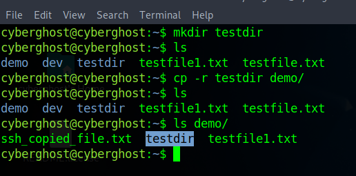

12:- Moving file from one location to another location

        Command:- mv <file-name> <directory-name>

13:- Connecting to Server with SSH

        Command:- ssh <server_user_name>@IP-Address

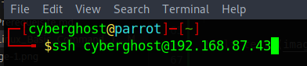

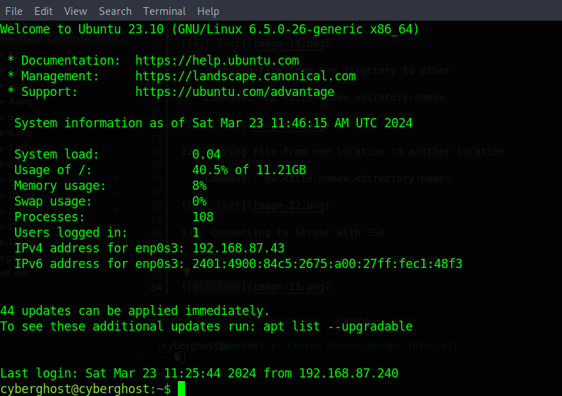

14:- Checking hostname

        Command:- hostname

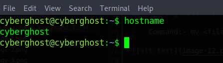

15:- To Check basic information about Operating sytem and hardware

         Command:- uname -a

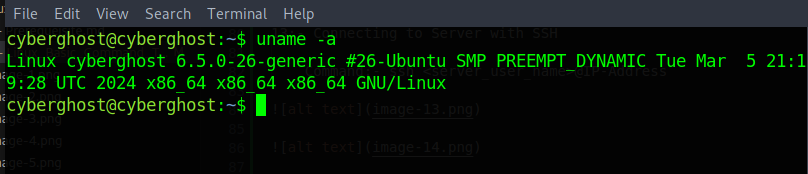

16:- To check the particular text in a file:-

        Command:- cat <filename> | grep "text-name"  

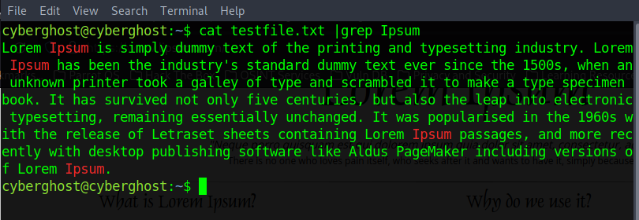

    Grep Command is a Case-Sensitive Command. To remove case-sensitiveness from text we have to use "-i" paramerter with "grep" command

        Command:- cat <filename> | grep -i "text-name"  

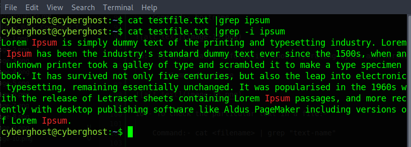

17:- Copy file from main sysem to server via SSH

        Command:- scp <filename> <user-name>@IP-Address:/<directory-name-with-path>

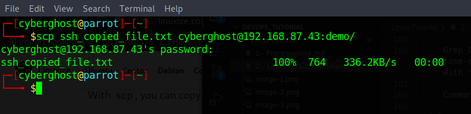

    File after coppied from main system to server

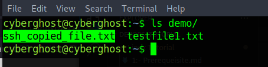

18:- Reading file line by line or page by page when content in file is very huge.

    Command:- less <file-name>

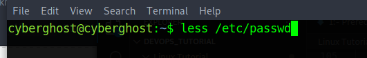

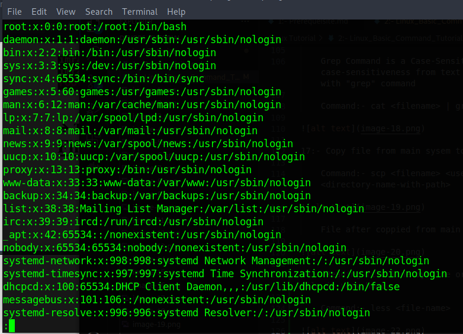

19:- Reading First Few Lines

        Command:- head <file-name>

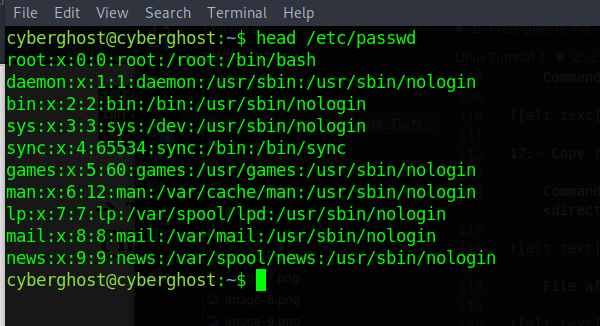

    Reading First Selected Number of lines like 5 or 10

        Command:- Command:- head -n 5 /etc/passwd

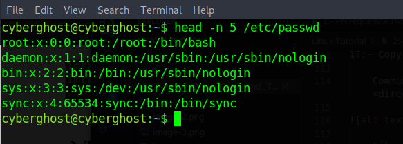

    Reading First Selected Bytes of Data from file.

        Command:- head -c 100 /etc/passwd

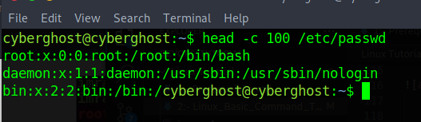  

20:- Reading Last Few Lines

        Command:- tail <file-name>

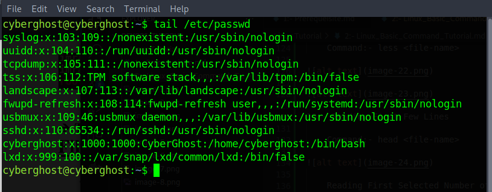

    Reading Last Selected Number of lines like 5 or 10

        Command:- tail -n 5 /etc/passwd

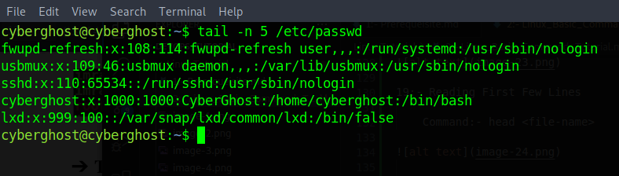

    Reading Last Selected Bytes of Data from file.

        Command:- tail -c 100 /etc/passwd

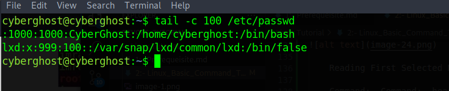

    Reading Some Random Line from file use '-f' parameter

        Command:- tail -f /etc/passwd

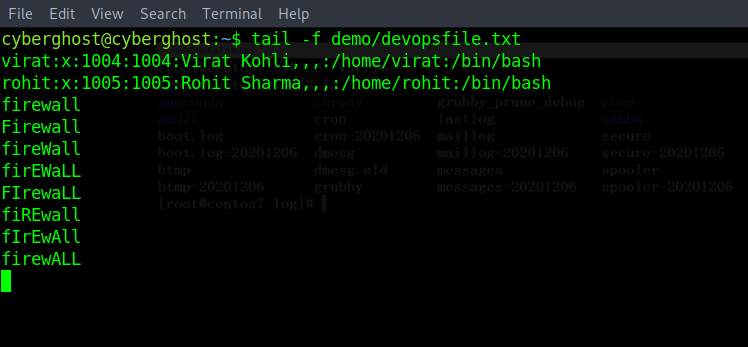

21:- Checking IP Address details of system

         Command:- ifconfig

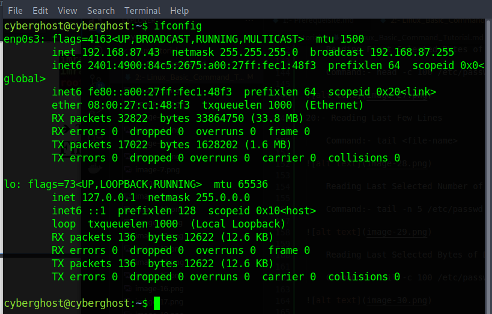

22:- Changing the Hostname:- 

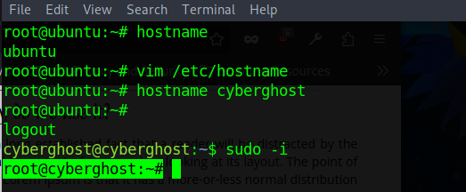

23:- Removing Directory:-

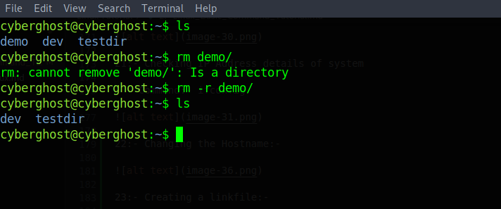

24:- Creating a linkfile:-

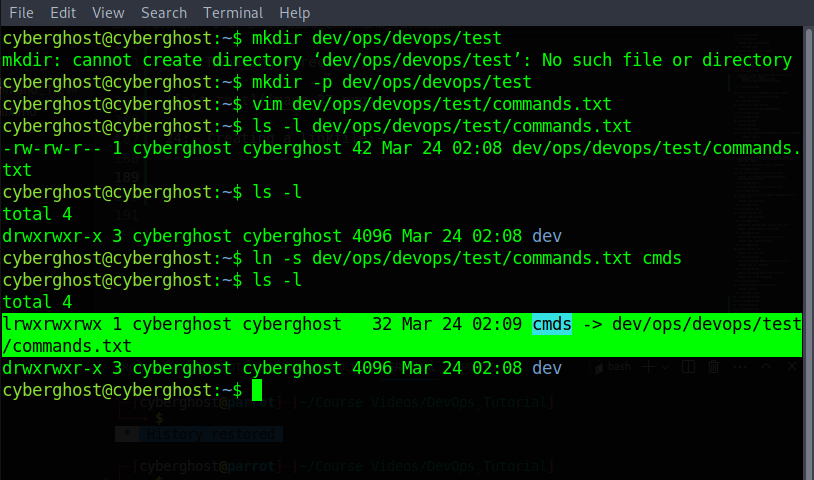

24:- Deleting the Linkfile and Aliving a DeadLink

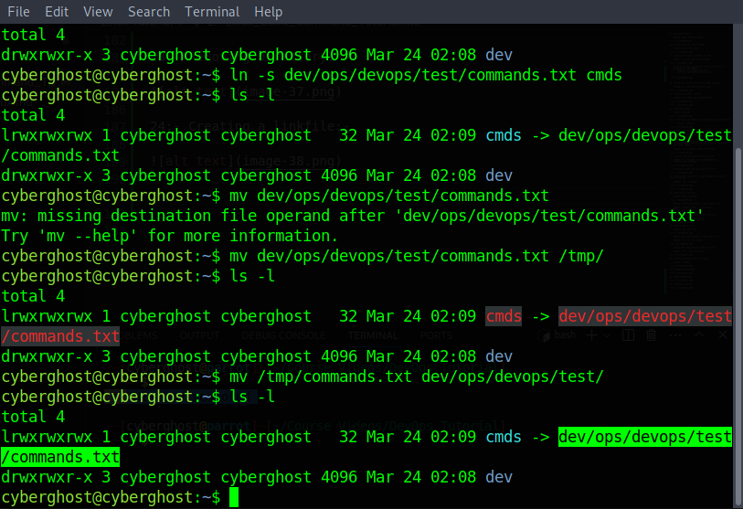

25:- Unlinking the DeadLink file or deirectory

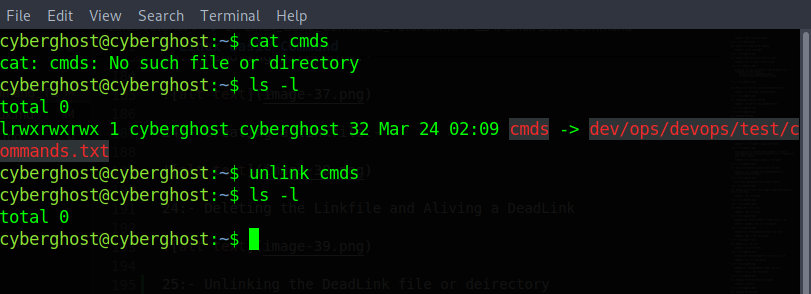

26:- Checking on which file user is currently working:-

        Command:- lsof -u <user-name>

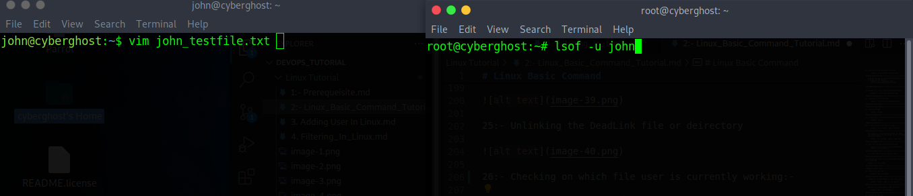

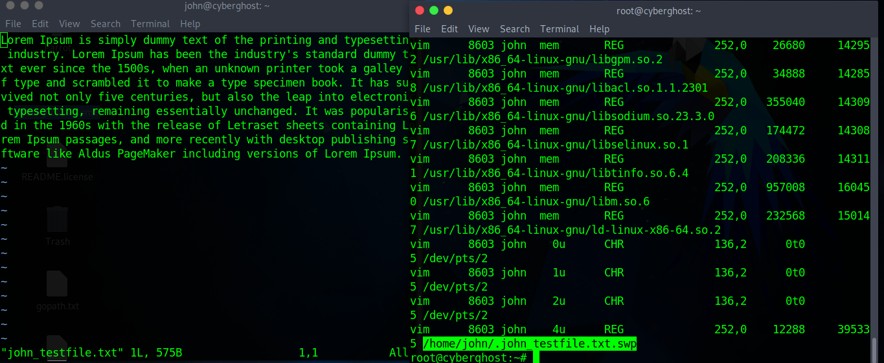

27:- Adding the user into sudoer list
        
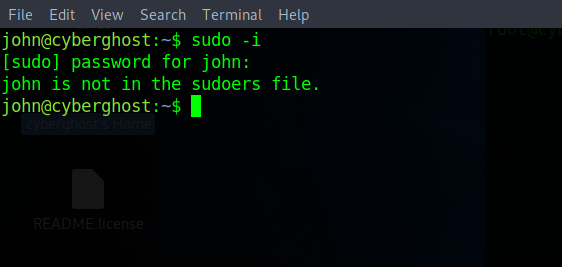

   1:- Open the 'visudo' file and type the below line

         <user>  ALL=(ALL:ALL) ALL
        
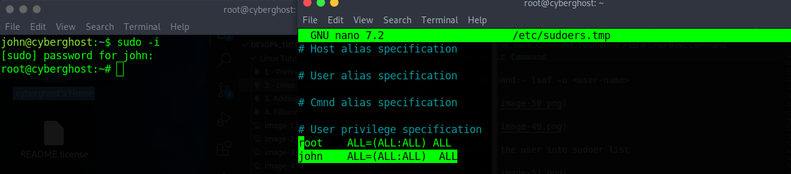

    2:- But is requiring for the password from the user when he is loggin but if you want that when user login to as a root user it is not asking for the password then you have to type 'NOPASSWD:' before the lass 'ALL'

        <user>  ALL=(ALL:ALL) ALL

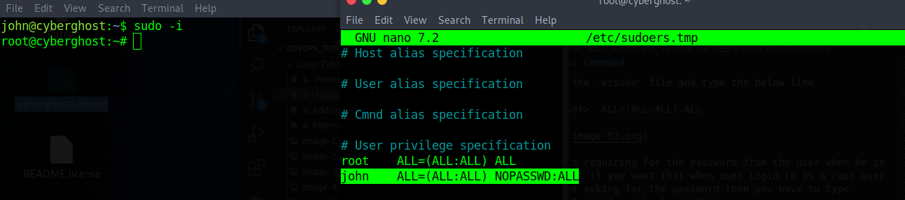

        3:- But when we making changes into sudoers file if we made any wrong changes then sudo will not work and making it correct is not easy. So it is advisable that you have to create file for your own group in '/etc/sudoers.d' directory by any name and give them permission you want to gave.

   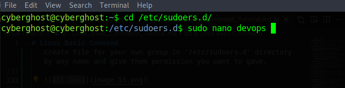

   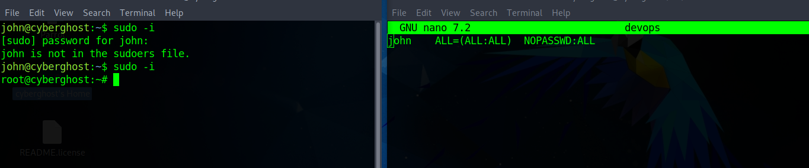

        4:- we can also add group into '/etc/sudoers.d' directory so we can assign sudo the permission to the whole group

                %<user>  ALL=(ALL:ALL) ALL

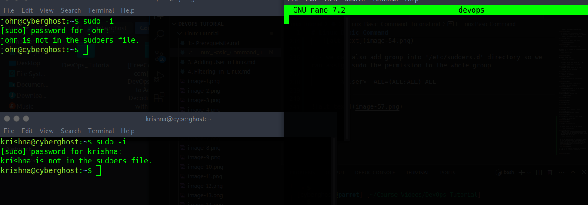

        After Adding the Group into the file

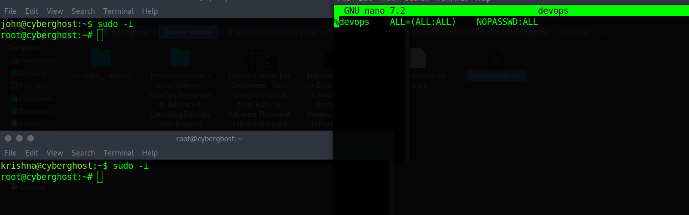

28:- For removing the package we use:- 

        Command:- apt remove <package-name>

     But the above command does not remove the configuration. So to remove configuration use below command:-

        Command:- apt purge <package-name>

