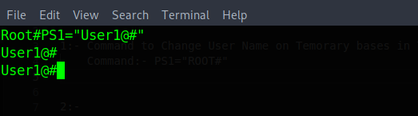
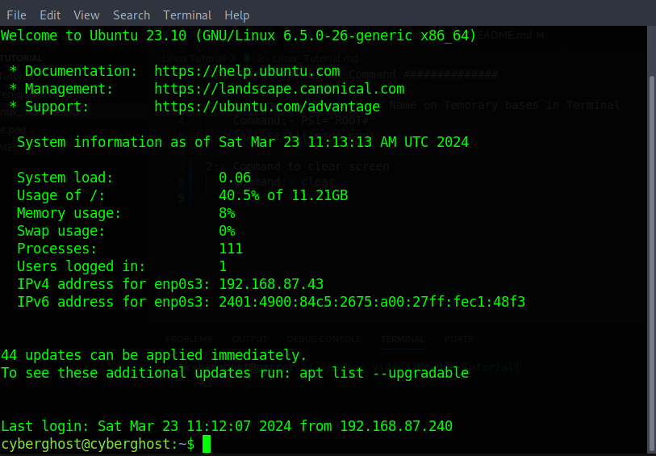
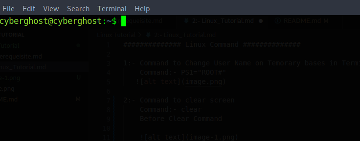
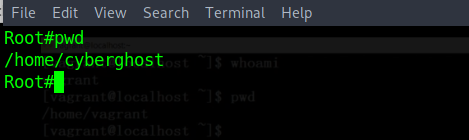

############## Linux Command ##############

1:- Command to Change User Name on Temorary bases in Terminal
    
    Command:- PS1="ROOT#"

2:- Command to clear screen

    Command:- clear

        Before Clear Command

        After Clear Command

3:- To check the current user
   
    Command:- whoami

4:- To Check the Present Working Directory

    Command:- pwd

5:- To check File in the directory we use

    Command:- ls and ls -la ("ls -;a" is used for listing with file with permission and file size )

6:- To Read the content of File.

    Command:- cat <FileName>

7:- Command for Swithcing to "Root" user.

    Command:- sudo -i

    

8:- Command to Change Directory

    Command:- cd <Directory Name>
