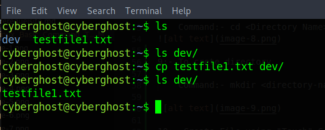
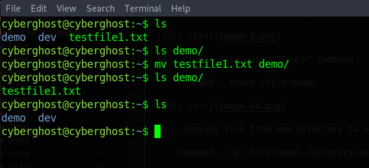

############## Linux Command ##############

1:- Command to Change User Name on Temorary bases in Terminal
    
    Command:- PS1="ROOT#"

2:- Command to clear screen

    Command:- clear

        Before Clear Command

        After Clear Command

3:- To check the current user
   
    Command:- whoami

4:- To Check the Present Working Directory

    Command:- pwd

5:- To check File in the directory we use

    Command:- ls and ls -la ("ls -;a" is used for listing with file with permission and file size )

6:- To Read the content of File.

    Command:- cat <FileName>

7:- Command for Swithcing to "Root" user.

    Command:- sudo -i

    

8:- Command to Change Directory

    Command:- cd <Directory Name>

9:- To crete directory 

    Command:- mkdir <directory-name>

10:- Create File using "Touch" Command

    Command:- touch <file-name>

11:- Copying file from one directory to other
    
    Command:- cp <file-name> <diretory-name>

12:- Moving file from one location to another location

    Command:- mv <file-name> <directory-name>

13:- Connecting to Server with SSH

    Command:- ssh <server_user_name>@IP-Address

14:- Checking hostname

    Command:- hostname

15:- To Check basic information about Operating sytem and hardware

        Command:- uname -a

16:- To check the particular text in a file:-

    Command:- cat <filename> | grep "text-name"  

    Grep Command is a Case-Sensitive Command. To remove case-sensitiveness from text we have to use "-i" paramerter with "grep" command

    Command:- cat <filename> | grep -i "text-name"  

17:- Copy file from main sysem to server via SSH

    Command:- scp <filename> <user-name>@IP-Address:/<directory-name-with-path>

    File after coppied from main system to server

18:- Reading file line by line or page by page when content in file is very huge.

    Command:- less <file-name>

19:- Reading First Few Lines

    Command:- head <file-name>

    Reading First Selected Number of lines like 5 or 10

    Command:- Command:- head -n 5 /etc/passwd

    Reading First Selected Bytes of Data from file.

    Command:- head -c 100 /etc/passwd

  

20:- Reading Last Few Lines

    Command:- tail <file-name>

    Reading Last Selected Number of lines like 5 or 10

    Command:- tail -n 5 /etc/passwd

    Reading Last Selected Bytes of Data from file.

    Command:- tail -c 100 /etc/passwd

21:- Checking IP Address details of system

    Command:- ifconfig

