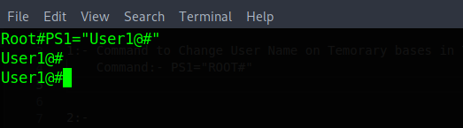
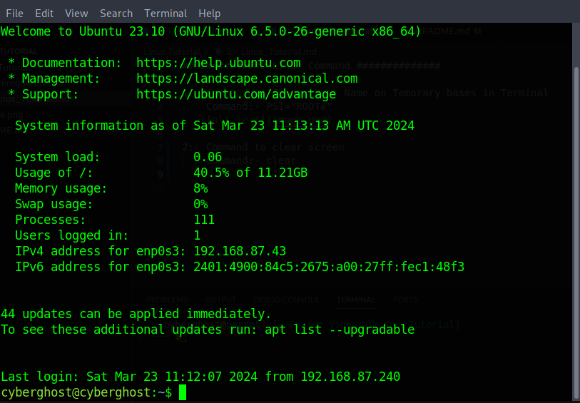
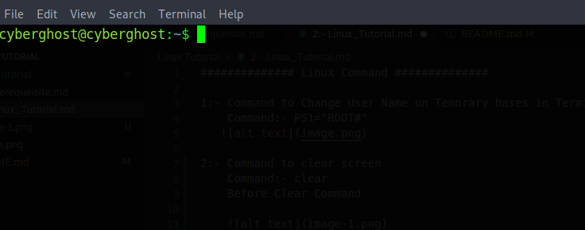

############## Linux Command ##############

1:- Command to Change User Name on Temorary bases in Terminal
    Command:- PS1="ROOT#"
   

2:- Command to clear screen
    Command:- clear

        Before Clear Command

        After Clear Command

