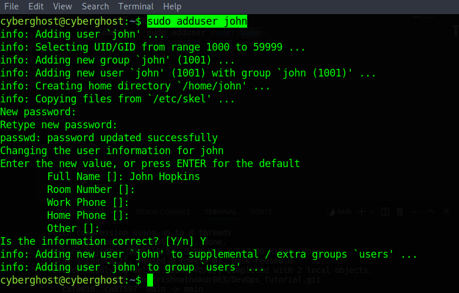
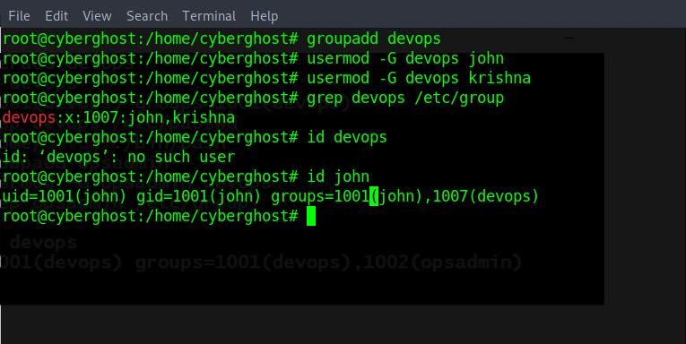

# Creating and Deleting User and Group (User and Group Related Operations)

1:- Adding User
    Command:- sudo adduser <user-name>

2:- Adding Groups and Adding User into Groups

    Command:- groupadd <group-name>
              usermod -G <group-name> <user-name>

    For Checking the Users Group details:-
        Command:- grep <group-name> /etc/group

    For Checking the User Details:-   
        id <user-name>

3:- Deleting The user and groups

    Command:- 1:- Creating Group:- 
                  Command:- sudo groupadd <group-name>
              2:- Check User Details:-   
                  Command:-id <user>
              3:- Adding User into group:-
                  Command:- sudo usermod -G <group-name> <user>
              4:- Check User Details:-   
                  Command:-id <user>
              5:- Deleting User
                  Command:- sudo userdel -r <user>
              6:- Check User Details:-   
                  Command:-id <user>
              7:- Deleting Group    
                  Command:- sudo groupdel <grup-name>

