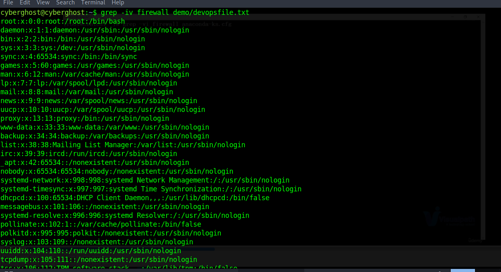

# Filtering In Linux

1:- Filtering using Grep Command:-

    Command:- grep <search-word> <File-Name>

    To Remove Case-Sensitiveness use '-i' parameter and to search in directory use '-R' parameter

    Command:- grep -i <search-word> <File-Name>
    Command:- grep -R <search-word> <File-Name>
    Command:- grep -iR <search-word> <File-Name>

  To remove particular word from search we can use '-v' parameter.

        Command:- grep -v <search-word> <File-Name>
        Command:- grep -iv <search-word> <File-Name>

2:- Checking log file for user who have logged in (In RedHat or Centos Filename is 'messages' and in Ubuntu or debian Filename is 'wtmp' which saves user information) 

3:- Changing the content on temporary bases with 'sed' command:-

    Command:- sed s'/<Word-Want-To-Replace>/<Word-From-Which-You-Want-To-Replace>/g' <filename>

Use '-i' to make permanent changes into the file

    Command:- sed -i s'/<Word-Want-To-Replace>/<Word-From-Which-You-Want-To-Replace>/g' <filename>

