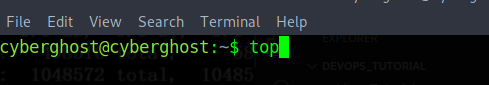
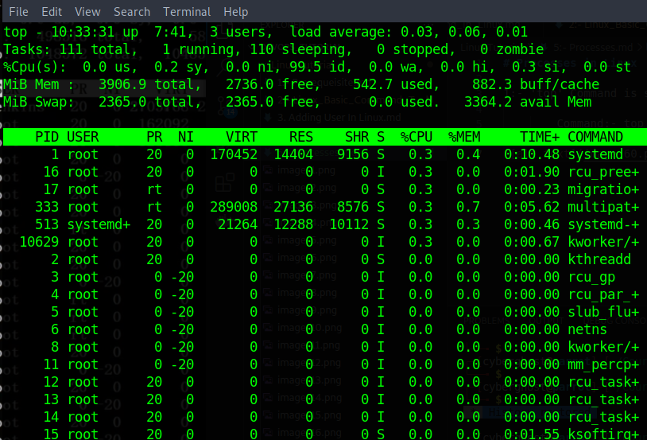
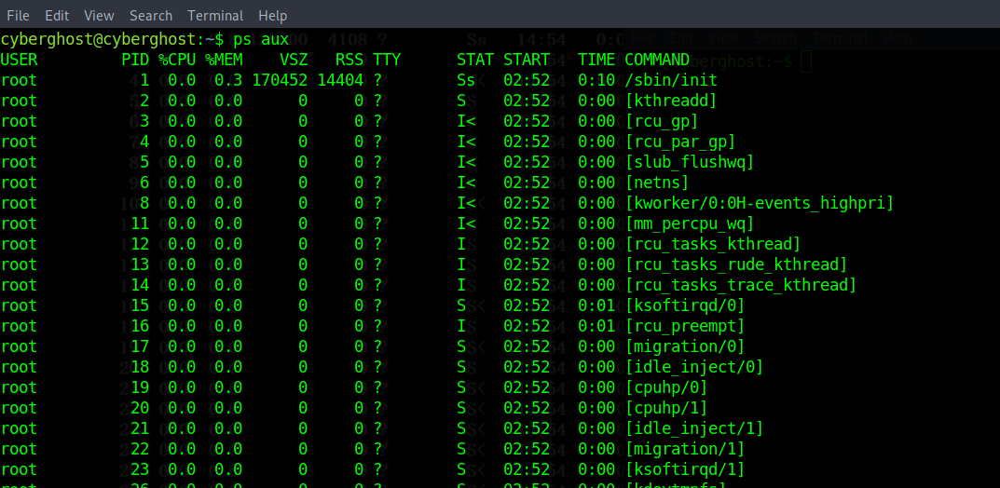
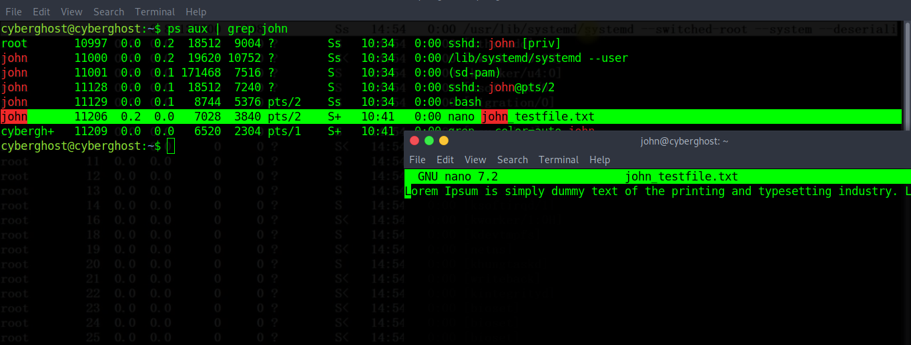
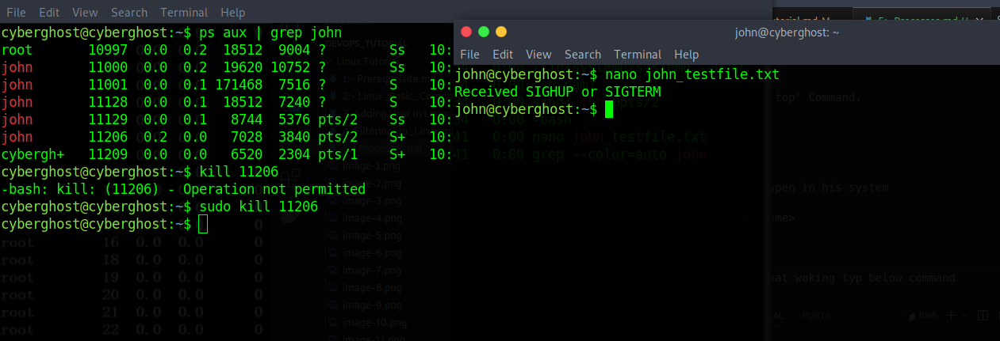
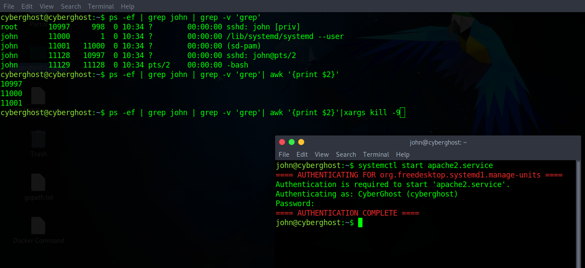
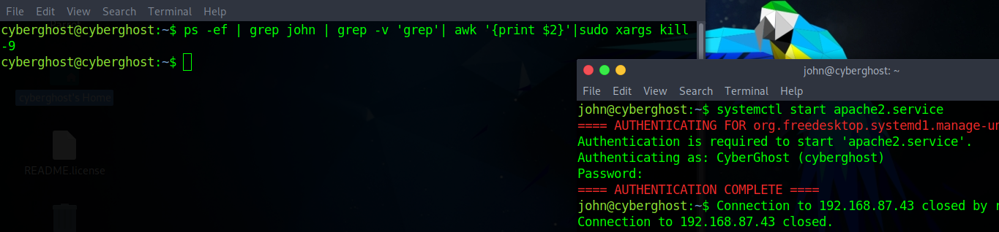

# Processes in Linux

1:- 'top' Command is similar to Task manager in windows. It shows all the running processes

        Command:- top

2:- 'ps aux' It is similar to 'top' Command.

        Command:- ps aux

3:- Just Check What user have open in his system

    Command:- ps aux | <user-name>

    To stop working him from that woking typ below command

    For Root User:- 
        
        Command :- kill <PID>

    For Non-Root User:-

        Command :- sudo kill <PID>

    To Stop forcefull we have to use below command:-
        
        Command:- sudo kill -9 <PID>

    To Stop all the running process by and stopping them by piping:-

        Command:- ps -ef | grep <user-name>| grep -v 'grep'| awk '{print $2}'|sudo xargs kill -9

